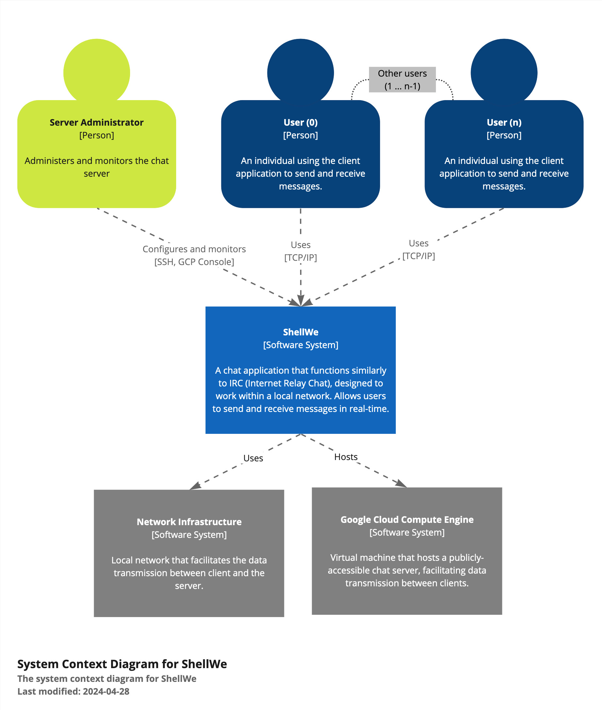
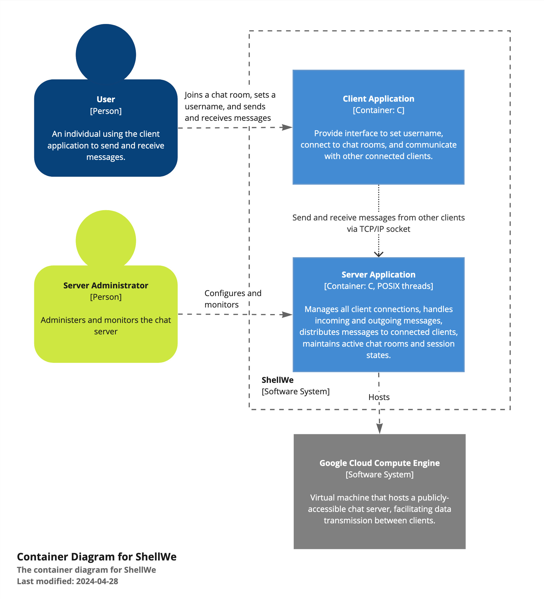

# `ShellWe`

`Shell` `We` chat? Using this application, a user can chat with other users in
the chat room.

## Building the Application

To build the `ChatClient` or `ChatServer` application, you can use the 
provided `CMakeLists.txt` file. The following steps will guide you through
building the application.

### Prerequisites

- `cmake`
- `make`
- `gcc`
- `ncurses` 
- `clang-tidy`
- `libcriterion-dev`
- `pthread`
- `git`

### Steps

```shell
git clone https://github.com/olincollege/ShellWe.git
cd ShellWe
mkdir build && cd build
cmake ..
make
# To test the server and utility functions
cd src/test
./test_server
./test_util

# To run the server locally
cd ../server
./ChatServer

# To run the client locally
cd ../client
./ChatClient 0.0.0.0
```

## Context

Our chat application provides an interface for users to chat with each other
using TCP/IP socket connections to the server. This program is an extremely
simplified version of Internet Relay Chat (IRC) where we only have a single
combined chat and service server. While a normal user will not be interacting
with the server directly, a server administrator will be accessing `ShellWe`
through remote ssh connection to the cloud hosting service, Google Cloud
Platform, or the provided console.

|  | 
|----------------------------------------|

## Containers

The chat system consists of two main parts: a server application and a client
application, both written in C. The server will interact with all the connected
clients and the clients will be able to communicate with each other through the
relaying chat server.

|  |
|--------------------------------------------|

## Components

### Server Application

The server application is hosted on a virtual machine available on Google Cloud
Compute Engine service. Network and firewall settings were configured such that
the virtual machine's ip address was accessible publicly for the TCP/IP
connections from chat application. We acknowledge that this is not the safest
choice, but for the sake of demonstration, we chose to go with the naive
configuration.

|  | 
|------------------------------------------------------------|

For the server container, we have two main components that run asynchronously.

- **Main Server Thread**: This component continuously listens for incoming TCP
  connections on a predefined port. Once a connection is established, it spawns
  a new thread (Worker Thread) to handle the connection.
- **Worker Thread**: Each connection has a dedicated worker thread. This thread
  is responsible for reading messages from the client, processing them if
  needed. It will relay the message to all the other connected clients.

|  |
|----------------------------------------|

To ensure proper management of connected clients, we used a mutex to protect an
array that contains all the connected socket file descriptor numbers.

### Client Application

To provide an enhanced user experience, we used `ncurses` library for our text
user interface. Once a user enters required information for configuration, an
input and output handlers are created and handles all network I/O tasks with the
server connected through TCP/IP socket.

|  |
|------------------------------------------------------------|

